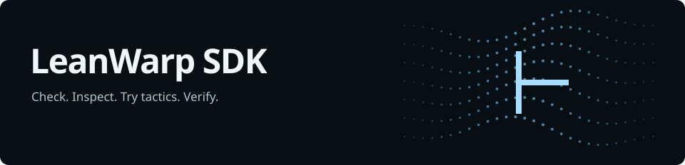

<h1></h1>

Faster Lean proof verification for developers and AI agents. Keep working in your
local project; LeanWarp runs verification remotely and reuses compatible imports
between checks.

**[Get started](docs/getting-started.md)** ·
[Documentation](docs/README.md) · [Agent setup](docs/agents.md) ·
[API reference](#http-api) · [Website](https://isagoge.in/leanwarp)

## Proof operations

| Operation | What you get | CLI |
| --- | --- | --- |
| `check` | Lean errors and warnings for a source file. | `leanwarp check` |
| `inspect` | The goals and local context at a position in a proof. | `leanwarp inspect` |
| `try_tactics` | Results of candidate tactics, without editing your source. | `leanwarp try-tactics` |
| `verify_target` | A check that your declaration proves the statement you supplied, with a verification receipt. | `leanwarp verify` |

### Coming soon

These operations are planned for upcoming releases and are not available yet:

- **Proof repair**: fill `sorry` placeholders with candidate proofs that Lean rechecks.
- **Proof simplification**: replace a proof with a shorter one that still checks.
- **Lemma extraction**: lift `sorry` goals or named `have` blocks into top-level lemmas.
- **Declaration extraction**: list the declarations a file adds, with their types.
- **Proof search**: explore tactic branches from a goal in the warm workspace.

The CLI and MCP adapter handle file uploads, workspace reuse and request recovery.
The Python library provides the same project workflow and a lower-level HTTP client.
See the [verification policy](src/leanwarp_cloud/skills/leanwarp/references/usage.md#verification-policy)
for the fixed-target guarantee and supported proof constructs.

## Install

With [uv](https://docs.astral.sh/uv/getting-started/installation/):

```sh
uv tool install --python 3.12 \
  'leanwarp-sdk @ git+https://github.com/Isagoge-Labs/LeanWarp-SDK.git'
```

This installs the `leanwarp` command and MCP adapter in an isolated environment.
Supported on Linux, macOS and WSL. Execution requires a supported Lean project,
an API key and funded account credit.

Follow [Getting started](docs/getting-started.md) to authenticate and verify your
first proof, or [set up your agent](docs/agents.md). Python applications use the
[library installation](src/leanwarp_cloud/skills/leanwarp/references/usage.md#python).

## Use with an agent

Create a key in the [dashboard](https://isagoge.in/dashboard), then run
`leanwarp auth login` and paste it at the hidden prompt. The key selects the
service; no API URL is needed.

Give your agent the project directory and this instruction:

> Read `leanwarp skill`. Use LeanWarp to check my Lean project and verify proofs
> against their intended statements. Reuse the workspace as you edit, and stop
> compute when finished.

For MCP clients, configure `leanwarp --project /absolute/path/to/project mcp`.
It uses the same credentials and project session as the CLI. See
[agent setup](docs/agents.md) for skill installation and the MCP configuration.
MCP also exposes the instructions as `leanwarp://guide` and `leanwarp://reference`.
Keep API keys out of prompts, source files and tool arguments.

## One workspace, successive checks

```text
Connect project → edit → check / inspect / try tactics / verify → read result
                    ↑                                              │
                    └────────────── same workspace ────────────────┘
```

- **Source stays versioned.** Changed files upload automatically. Each operation
  runs against a specific revision; the project session remembers the IDs.
- **Compatible work stays warm.** Successive calls, including verification, can
  reuse the worker and its imports. Every verification still checks the supplied
  target independently. Saved source survives a worker restart; in-memory state
  does not.
- **Results are explicit.** Submission starts an operation; `--wait SECONDS`
  (or the MCP tools' default 20-second wait) returns its result in the same call,
  and `leanwarp wait` retrieves work that is still running. A completed operation
  does not necessarily mean the proof passed. See [results and exit codes](src/leanwarp_cloud/skills/leanwarp/references/usage.md#results).

Use `leanwarp doctor` to check the project's toolchain and dependencies against
supported environments. LeanWarp does not build arbitrary project dependencies.
Start with an included example project ([Lean 4.26](examples/lean-4.26) or
[Lean 4.34](examples/lean-4.34)) if you want to try verification before connecting
an existing project.
For a separate temporary verification worker, use `verify --fresh`.

Manage funding and optional workspace lifetime caps in **Dashboard → Usage &
credits**. Compute requires available prepaid credit, including reservations.
Warm idle time is billed until compute stops: use `leanwarp stop` when finished.
Changing a cap does not cancel already reserved work.
If an operation is active, wait for it or cancel it and wait before stopping.

## HTTP API

All paths below are relative to `/v1/leanwarp`. Project operations and state
queries use `Authorization: Bearer <API_KEY>`; dashboard controls use an account
session token. The SDK selects the service and manages workspace, revision and
operation IDs for the normal project workflow.

### Project workflow

| Method | Endpoint | Purpose |
| --- | --- | --- |
| `GET` | `/versions` | Find supported Lean and Mathlib environments. |
| `POST` | `/workspaces` | Create a workspace without starting compute. |
| `PUT` | `/workspaces/{workspace_id}/files` | Synchronize source and receive its new revision. |
| `POST` | `/workspaces/{workspace_id}/operations` | Submit `check`, `inspect`, `try_tactics` or `verify_target`. |
| `GET` | `/operations/{operation_id}` | Read status, result and the checked revision. |
| `POST` | `/workspaces/{workspace_id}/stop` | Stop compute while keeping saved source. |

The four proof operations share the operations endpoint. Submission returns
`202 Accepted`; poll the operation endpoint for the result. Workspace creation,
file synchronization and operation submission require an `Idempotency-Key`.
Synchronization and submission also require `expected_revision`.

### Account and workspace state

| Method | Endpoint | Purpose |
| --- | --- | --- |
| `GET` | `/account` | Read balance, reserved funds and available credit. |
| `GET` | `/resources` | List available compute profiles. |
| `GET` | `/workspaces` | List workspaces accessible to your key. |
| `GET` | `/workspaces/{workspace_id}` | Read workspace state and its current revision. |
| `POST` | `/operations/{operation_id}/cancel` | Request cancellation; poll until the operation is terminal. |
| `DELETE` | `/workspaces/{workspace_id}` | Delete a workspace. |

<details>
<summary><strong>Dashboard endpoints — account authentication required</strong></summary>

These endpoints use your signed-in account session token, not an SDK API key.
Manage keys and spending limits through the dashboard.

| Method | Endpoint | Purpose |
| --- | --- | --- |
| `POST` | `/api-keys` | Create a scoped key; return its secret once. |
| `GET` | `/api-keys` | List key metadata without exposing secrets. |
| `DELETE` | `/api-keys/{key_id}` | Revoke a key. |
| `GET` | `/account/spending-limits` | List workspace caps, spent usage and reservations. |
| `PUT` | `/account/spending-limits/{workspace_id}` | Update an owned workspace's cap after checking its current value and committed usage. |

</details>

## Documentation

| Start here | Reference |
| --- | --- |
| [Verify your first proof](docs/getting-started.md) | [Commands and workspace reuse](src/leanwarp_cloud/skills/leanwarp/references/usage.md#commands) |
| [Connect an agent through CLI or MCP](docs/agents.md) | [Results and exit codes](src/leanwarp_cloud/skills/leanwarp/references/usage.md#results) |
| [Use the Python library](src/leanwarp_cloud/skills/leanwarp/references/usage.md#python) | [Recover an interrupted request](src/leanwarp_cloud/skills/leanwarp/references/usage.md#recovery) |
| [Install the agent skill](src/leanwarp_cloud/skills/leanwarp) | [Credentials, credit and limits](src/leanwarp_cloud/skills/leanwarp/references/usage.md#credentials-credit-and-limits) |

The agent instructions ship with the package: `leanwarp skill` prints the
workflow, and `leanwarp skill --reference` prints the full reference. Use
`leanwarp COMMAND --help` for arguments.
